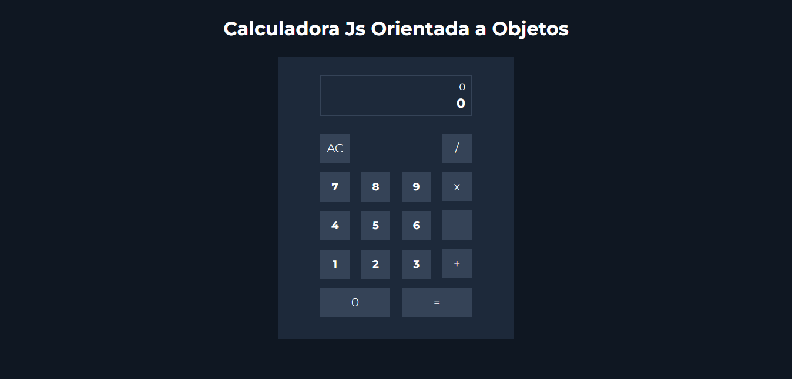

# PROJETO: Calculadora Js orientada a objetos

O projeto da calculadora foi desenvolvido com ênfase na orientação a objetos, baseado em classes e nas técnicas mais modernas de JavaScript como os recursos do ES6.

A calculadora realiza as 4 operações básicas da matemática e também realiza a limpeza dos dados exibidos no display no clique do botão "AC".
